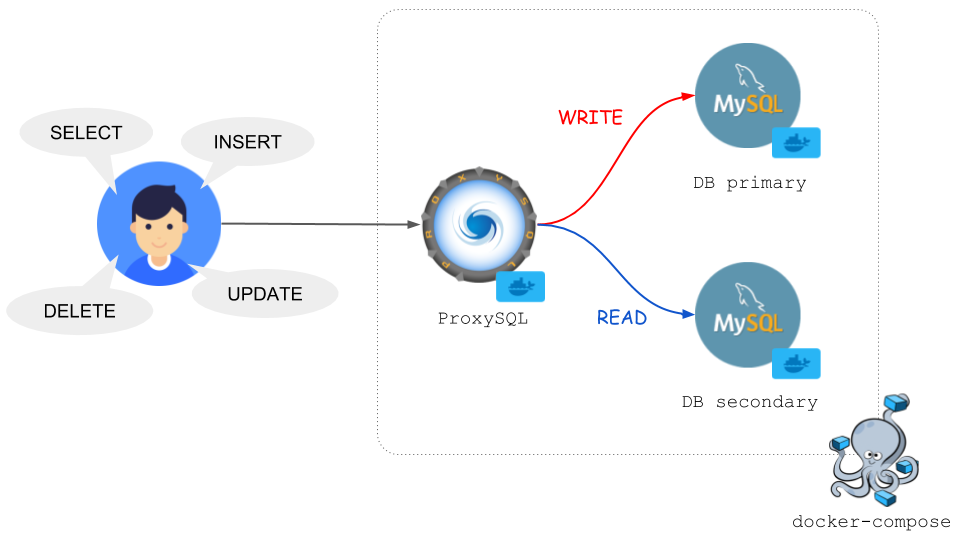

# Laravel MySQL Replication and ProxySQL

In this documentation, we will cover

1. Problem Discussion
    - Common Database problems and solutions.
    - What is Database Replication?
    - When do you need this?
2. MySQL DB Replication (1 master and  2 slaves) on Docker
3. Load Balancing them using ProxySQL on Docker
4. Sending Request from our Laravel Application.
5. Observe the Query Execution in the Master and Slave's General log


## What is DB Replication?
DB Replication is a kind of Horizontal Scaling making the same copy of the Full Database and Distribute them in **Master/Slave** architecture where the **Master** deals with all the **Write** operations and *Periodically Updates* it's **Slave** Replicas, who will Handle only the **Read** queries. So your Database load is Distributed now. But remember, the *Slaves* must be **Consistent** with the *Master* so there must be a Replication Strategy.

### How the Replication works from Master to Slaves?
After any Write Query (Insert. Update, Delete) executed in the Master, the DB somehow Replicate the changes to the Slaves. The Master  triggers a change event and the Slaves pull the Changes from the Event and Update themselves. Let's generate some ideas on this.

Idea 1: Can we Stream the SQL Statements?

So Basically, We will be Streaming the SQL Query Statements and the Slaves will pull them from the channel and Execute those SQL Statements inside themselves. Well, this can make the Replication **Inconsistent**. Let's see how.
Assume, you are Creating a new Product
```sql
INSERT INTO posts (title, details, created_at)
VALUES('test', 'test details', CURRENT_TIMESTAMP)
```
- Firstly, The Query will be executed at *Master* when the value of *CURRENT_TIMESTAMP = 2023-10-21 12:04:59.114*

- Secondly, The Query will be executed at *Slave 1* when the value of *CURRENT_TIMESTAMP = 2023-10-21 12:05:00.100*

- Thirdly, The Query will be executed at *Slave 2* when the value of *CURRENT_TIMESTAMP = 2023-10-21 12:05:00.405*

Epic Fail!! Right? This will certainly create inconsitancy problem. So we need to drop this idea.

Idea 2: How about Transfering [Bin Log](https://dev.mysql.com/doc/internals/en/binary-log-overview.html) files?

> The binary log is a set of log files that contain information about data modifications made to a MySQL server instance. Simply it saves the Database States

So, When any Write Query executes in the Master Replica, the change is saved into the Bin Log. After that the Master will transfer these log files towards the Slave Databases **asynchronusly** and the Slaves will pull the change and update their states according to the bin logs.There are also other replication staratagies like Synchronus, Asynchronus and Semi-Asynchronus, but Mysql do Asynchronus replication by default so we are gonna use this for now.

But another problem is knocking at the door. How will you distribute the traffics to the appropriate DB Replicas?
Since, you have a multiple instances of the same database depending on *Read/Write* purpose, how your application can differenfiate when to go to the Read Replica and when to the Master Replica.
-   DB connection information can change on the way
-   It is troublesome (but complicated) to use DB properly in the Read/Write logic of the application.

So we need a Reverse Proxy for sure to solve this problem. The proxy sits in-between of the Application and Database and Load Balance the Request to the different DB instances based on our operation types (Read/Write). But how the Proxy will distinguish the Request Type ? The answere is the Proxy must be **SQLAware**. We are going to use `ProxySQL` here.

## What is ProxySql?



`ProxySQL` is an *Opensource SQLAware Reverse Proxy* unlike other HTTP or TCP proxy (Nginx, HAProxy etc) it can distinguish the Read/Write operations and deliver the packet to the Specific Replica either it's Master or Slave.
ProxySQL goes between the application and the DB and does the following:
-   Automatic Proxify to the Master/Slave depending on query
-   Load Distribution
-   Change seamless connection settings
    By the way, ProxySQL can be used with other DBs like Postgres as well.

## Project installation instruction

### Run Mysql Project

    cd mysql
    cp .env.example .env
    docker-compose up -d
    docker ps
     
### Run Laravel Project  

    cd laravel/docker
    cp .env.example .env
    cp docker-compose.override.example.yml docker-compose.override.yml
    cd /.envs
    cp php-fpm.env.example php-fpm.env
    cp php-ini.env.example php-ini.env
    cp web.env.example web.env
    docker-compose up -d
    docker-compose exec -it app composer install
    docker-compose exec -it app php artisan key:generate
    docker-compose exec -it app php artisan migrate


### Check Master's Status
    docker-compose exec master sh
    mysql -u root -p 
    riad  
    show master status\G;
```
Expected Output:

*************************** 1. row ***************************
File: mysql-bin.000004
Position: 1877
Binlog_Do_DB: mydb
Binlog_Ignore_DB:
Executed_Gtid_Set: 0d1661ad-6cc5-11ee-a9ce-0242ac190002:1-31
```

### Check Slave 1 Status

    docker-compose exec slave1 sh 
    mysql -u root -p 
    riad 
    show slave status\G;

```
Expected Output:

*************************** 1. row ***************************
               Slave_IO_State: Waiting for source to send event
                  Master_Host: master
                  Master_User: slave_user
                  Master_Port: 3306
                Connect_Retry: 60
              Master_Log_File: mysql-bin.000004
          Read_Master_Log_Pos: 1877
               Relay_Log_File: mysql-relay-bin.000006
                Relay_Log_Pos: 2093
        Relay_Master_Log_File: mysql-bin.000004
             Slave_IO_Running: Yes
            Slave_SQL_Running: Yes
              Replicate_Do_DB: 
          Replicate_Ignore_DB: 
           Replicate_Do_Table: 
       Replicate_Ignore_Table: 
      Replicate_Wild_Do_Table: 
  Replicate_Wild_Ignore_Table: 
                   Last_Errno: 0
                   Last_Error: 
                 Skip_Counter: 0
          Exec_Master_Log_Pos: 1877
              Relay_Log_Space: 9479
              Until_Condition: None
               Until_Log_File: 
                Until_Log_Pos: 0
           Master_SSL_Allowed: No
           Master_SSL_CA_File: 
           Master_SSL_CA_Path: 
              Master_SSL_Cert: 
            Master_SSL_Cipher: 
               Master_SSL_Key: 
        Seconds_Behind_Master: 0
Master_SSL_Verify_Server_Cert: No
                Last_IO_Errno: 0
                Last_IO_Error: 
               Last_SQL_Errno: 0
               Last_SQL_Error: 
  Replicate_Ignore_Server_Ids: 
             Master_Server_Id: 1
                  Master_UUID: 0d1661ad-6cc5-11ee-a9ce-0242ac190002
             Master_Info_File: mysql.slave_master_info
                    SQL_Delay: 0
          SQL_Remaining_Delay: NULL
      Slave_SQL_Running_State: Replica has read all relay log; waiting for more updates
           Master_Retry_Count: 86400
                  Master_Bind: 
      Last_IO_Error_Timestamp: 
     Last_SQL_Error_Timestamp: 
               Master_SSL_Crl: 
           Master_SSL_Crlpath: 
           Retrieved_Gtid_Set: 0d1661ad-6cc5-11ee-a9ce-0242ac190002:1-31
            Executed_Gtid_Set: 0d1661ad-6cc5-11ee-a9ce-0242ac190002:1-31,
0d697c00-6cc5-11ee-ab3a-0242ac190004:1-5
                Auto_Position: 1
         Replicate_Rewrite_DB: 
                 Channel_Name: 
           Master_TLS_Version: 
       Master_public_key_path: 
        Get_master_public_key: 0
            Network_Namespace: 
1 row in set, 1 warning (0.00 sec)

```

### Check Slave 2 Status

    docker-compose exec slave2 sh 
    mysql -u root -p 
    riad 
    show slave status\G;

```
Expected Output:

*************************** 1. row ***************************
               Slave_IO_State: Waiting for source to send event
                  Master_Host: master
                  Master_User: slave_user
                  Master_Port: 3306
                Connect_Retry: 60
              Master_Log_File: mysql-bin.000004
          Read_Master_Log_Pos: 1877
               Relay_Log_File: mysql-relay-bin.000006
                Relay_Log_Pos: 2093
        Relay_Master_Log_File: mysql-bin.000004
             Slave_IO_Running: Yes
            Slave_SQL_Running: Yes
              Replicate_Do_DB: 
          Replicate_Ignore_DB: 
           Replicate_Do_Table: 
       Replicate_Ignore_Table: 
      Replicate_Wild_Do_Table: 
  Replicate_Wild_Ignore_Table: 
                   Last_Errno: 0
                   Last_Error: 
                 Skip_Counter: 0
          Exec_Master_Log_Pos: 1877
              Relay_Log_Space: 9479
              Until_Condition: None
               Until_Log_File: 
                Until_Log_Pos: 0
           Master_SSL_Allowed: No
           Master_SSL_CA_File: 
           Master_SSL_CA_Path: 
              Master_SSL_Cert: 
            Master_SSL_Cipher: 
               Master_SSL_Key: 
        Seconds_Behind_Master: 0
Master_SSL_Verify_Server_Cert: No
                Last_IO_Errno: 0
                Last_IO_Error: 
               Last_SQL_Errno: 0
               Last_SQL_Error: 
  Replicate_Ignore_Server_Ids: 
             Master_Server_Id: 1
                  Master_UUID: 0d1661ad-6cc5-11ee-a9ce-0242ac190002
             Master_Info_File: mysql.slave_master_info
                    SQL_Delay: 0
          SQL_Remaining_Delay: NULL
      Slave_SQL_Running_State: Replica has read all relay log; waiting for more updates
           Master_Retry_Count: 86400
                  Master_Bind: 
      Last_IO_Error_Timestamp: 
     Last_SQL_Error_Timestamp: 
               Master_SSL_Crl: 
           Master_SSL_Crlpath: 
           Retrieved_Gtid_Set: 0d1661ad-6cc5-11ee-a9ce-0242ac190002:1-31
            Executed_Gtid_Set: 0d1661ad-6cc5-11ee-a9ce-0242ac190002:1-31,
0d623cdc-6cc5-11ee-ab80-0242ac190003:1-5
                Auto_Position: 1
         Replicate_Rewrite_DB: 
                 Channel_Name: 
           Master_TLS_Version: 
       Master_public_key_path: 
        Get_master_public_key: 0
            Network_Namespace: 
1 row in set, 1 warning (0.00 sec)
...
```

## Check Replication States now
Incase you don't have mysql client installed in your machine then install it first, the execute the command bellow.
- Mysql Installation (Ubuntu 20.04) (Optional)
```
$ wget https://dev.mysql.com/get/mysql-apt-config_0.8.20-1_all.deb 
$ dpkg -i mysql-apt-config_0.8.20-1_all.deb # and select mysql-8.0 
$ sudo apt install mysql-server-8.0
```
- ProxySQL
```
$ mysql -h 0.0.0.0 -P 6032 -u admin2 -p -e 'select * from mysql_servers'
```
Enter password: pass2
```
+--------------+----------+------+-----------+--------+--------+-------------+-----------------+---------------------+---------+----------------+---------+
| hostgroup_id | hostname | port | gtid_port | status | weight | compression | max_connections | max_replication_lag | use_ssl | max_latency_ms | comment |
+--------------+----------+------+-----------+--------+--------+-------------+-----------------+---------------------+---------+----------------+---------+
| 10           | master   | 3306 | 0         | ONLINE | 1      | 0           | 100             | 5                   | 0       | 0              |         |
| 20           | slave1   | 3306 | 0         | ONLINE | 1      | 0           | 100             | 5                   | 0       | 0              |         |
| 20           | slave2   | 3306 | 0         | ONLINE | 1      | 0           | 100             | 5                   | 0       | 0              |         |
+--------------+----------+------+-----------+--------+--------+-------------+-----------------+---------------------+---------+----------------+---------+

```
Looks Good, All the Master and Slaves are Online and Synced up.

Now Open a new Terminal and Try to run some query and Monitor the General Logs of Master and Slaves

## Showtime
All our tedious configuration is done, now lets open 3 terminals 1 for master and other 2 for slaves and place them side by side so that you can monitor all of them together. Try to run some Read/Write query from your Laravel application or any Database Client like Mysql Workbench and Monitor the General Logs of Master and Slaves

1. Read ALL Posts
> URL: http://localhost:8888/post


**Output from SLAVE 1 Console**
```
docker-compose exec slave1 sh -c 'tail -f /var/log/mysql/*.log'
```
Output:
```
==> /var/log/mysql/general.log <==
2023-10-21T13:43:28.253028Z	  939 Query	SELECT @@global.read_only read_only
2023-10-21T13:43:28.253934Z	  939 Query	SET wait_timeout=2000
2023-10-21T13:43:29.256418Z	  939 Query	SELECT @@global.read_only read_only
2023-10-21T13:43:30.253353Z	  939 Query	SELECT @@global.read_only read_only
2023-10-21T13:43:31.241423Z	  939 Query	SELECT @@global.read_only read_only
2023-10-21T13:43:32.260886Z	  939 Query	SELECT @@global.read_only read_only
2023-10-21T13:43:33.242897Z	  939 Query	SELECT @@global.read_only read_only
2023-10-21T13:43:34.251212Z	  939 Query	SELECT @@global.read_only read_only
2023-10-21T13:43:35.259187Z	  939 Query	SELECT @@global.read_only read_only
2023-10-21T13:43:36.252460Z	  939 Query	SELECT @@global.read_only read_only

2023-10-21T13:44:17.249047Z	  944 Query	SELECT @@global.read_only read_only
2023-10-21T13:44:17.316699Z	   33 Execute	select count(*) as aggregate from `posts`
2023-10-21T13:44:17.317800Z	   33 Execute	select * from `posts` order by `created_at` desc limit 5 offset 0
2023-10-21T13:44:18.087403Z	   33 Execute	select * from `posts` order by `created_at` desc limit 5 offset 0
2023-10-21T13:44:18.096423Z	  944 Query	SHOW SLAVE STATUS
2023-10-21T13:44:18.096563Z	  944 Quit	

```

**Execute the Same API again and Check the output in SLAVE 2 Console**
```
docker-compose exec slave2 sh -c 'tail -f /var/log/mysql/*.log'
```
Output:
```
==> /var/log/mysql/general.log <==
2023-10-21T13:50:27.971182Z	  983 Quit	
2023-10-21T13:50:28.100303Z	  982 Query	SHOW SLAVE STATUS
2023-10-21T13:50:28.100645Z	  982 Quit	
2023-10-21T13:50:28.311555Z	  984 Connect	monitor@172.25.0.7 on  using TCP/IP
2023-10-21T13:50:28.311827Z	  984 Query	SELECT @@global.read_only read_only
2023-10-21T13:50:28.312191Z	  984 Query	SET wait_timeout=2000
2023-10-21T13:50:29.326347Z	  984 Query	SELECT @@global.read_only read_only
2023-10-21T13:50:30.303282Z	  984 Query	SELECT @@global.read_only read_only
2023-10-21T13:50:31.304409Z	  984 Query	SELECT @@global.read_only read_only
2023-10-21T13:50:32.303746Z	  984 Query	SELECT @@global.read_only read_only

2023-10-21T13:51:03.309149Z	  987 Query	SELECT @@global.read_only read_only
2023-10-21T13:51:03.785637Z	   18 Execute	select count(*) as aggregate from `posts`
2023-10-21T13:51:03.936933Z	   18 Execute	select count(*) as aggregate from `posts`
2023-10-21T13:51:03.938068Z	   18 Execute	select * from `posts` order by `created_at` desc limit 5 offset 0
2023-10-21T13:51:04.268708Z	   18 Execute	select * from `posts` order by `created_at` desc limit 5 offset 0
2023-10-21T13:51:04.318569Z	  987 Query	SELECT @@global.read_only read_only
2023-10-21T13:51:05.316814Z	  987 Query	SELECT @@global.read_only read_only
2023-10-21T13:51:06.308693Z	  987 Query	SELECT @@global.read_only read_only
2023-10-21T13:51:07.331376Z	  987 Query	SELECT @@global.read_only read_only
2023-10-21T13:51:08.101245Z	  987 Query	SHOW SLAVE STATUS
2023-10-21T13:51:08.101758Z	  987 Quit	

```

2. CREATE NEW POST
> URL: http://localhost:8888/post
```
**Check MASTER Status:**
```
docker-compose exec master sh -c 'tail -f /var/log/mysql/*.log'

**Output from Master Console:**
```
2023-10-21T13:52:15.925414Z	   14 Execute	set session sql_mode='ONLY_FULL_GROUP_BY,STRICT_TRANS_TABLES,NO_ZERO_IN_DATE,NO_ZERO_DATE,ERROR_FOR_DIVISION_BY_ZERO,NO_ENGINE_SUBSTITUTION'
2023-10-21T13:52:15.934738Z	   14 Prepare	insert into `posts` (`title`, `details`, `updated_at`, `created_at`) values (?, ?, ?, ?)
2023-10-21T13:52:15.934912Z	   14 Execute	insert into `posts` (`title`, `details`, `updated_at`, `created_at`) values ('test7', 'test details', '2023-10-21 13:52:15', '2023-10-21 13:52:15')
2023-10-21T13:52:15.943967Z	   14 Change user	root@172.25.0.7 on mydb using TCP/IP
2023-10-21T13:52:16.031189Z	   14 Query	SET NAMES utf8mb4 COLLATE 'utf8mb4_unicode_ci'
2023-10-21T13:52:16.031388Z	   14 Prepare	set names 'utf8mb4' collate 'utf8mb4_unicode_ci'
2023-10-21T13:52:16.031411Z	   14 Execute	set names 'utf8mb4' collate 'utf8mb4_unicode_ci'
2023-10-21T13:52:16.031982Z	   14 Query	SET sql_mode='ONLY_FULL_GROUP_BY,STRICT_TRANS_TABLES,NO_ZERO_IN_DATE,NO_ZERO_DATE,ERROR_FOR_DIVISION_BY_ZERO,NO_ENGINE_SUBSTITUTION'
2023-10-21T13:52:16.032167Z	   14 Prepare	set session sql_mode='ONLY_FULL_GROUP_BY,STRICT_TRANS_TABLES,NO_ZERO_IN_DATE,NO_ZERO_DATE,ERROR_FOR_DIVISION_BY_ZERO,NO_ENGINE_SUBSTITUTION'
2023-10-21T13:52:16.032198Z	   14 Execute	set session sql_mode='ONLY_FULL_GROUP_BY,STRICT_TRANS_TABLES,NO_ZERO_IN_DATE,NO_ZERO_DATE,ERROR_FOR_DIVISION_BY_ZERO,NO_ENGINE_SUBSTITUTION'
2023-10-21T13:52:16.336802Z	  991 Query	SELECT @@global.read_only read_only
2023-10-21T13:52:17.334788Z	  991 Query	SELECT @@global.read_only read_only

```
**Output from SLAVE 1 Console:**
```
2023-10-21T13:52:15.342339Z	  994 Query	SELECT @@global.read_only read_only
2023-10-21T13:52:15.937870Z	    7 Query	BEGIN
2023-10-21T13:52:15.937978Z	    7 Query	COMMIT /* implicit, from Xid_log_event */
2023-10-21T13:52:16.032591Z	   33 Execute	select count(*) as aggregate from `posts`
2023-10-21T13:52:16.318983Z	  994 Query	SELECT @@global.read_only read_only
2023-10-21T13:52:17.319191Z	  994 Query	SELECT @@global.read_only read_only
2023-10-21T13:52:18.104263Z	  994 Query	SHOW SLAVE STATUS
2023-10-21T13:52:18.104736Z	  994 Quit

```
**Output from SLAVE 2 Console:**
```
2023-10-21T13:52:15.330862Z	  994 Query	SELECT @@global.read_only read_only
2023-10-21T13:52:15.937870Z	    9 Query	BEGIN
2023-10-21T13:52:15.937990Z	    9 Query	COMMIT /* implicit, from Xid_log_event */
2023-10-21T13:52:16.033516Z	   18 Execute	select * from `posts` order by `created_at` desc limit 5 offset 0
2023-10-21T13:52:16.327862Z	  994 Query	SELECT @@global.read_only read_only
2023-10-21T13:52:17.327136Z	  994 Query	SELECT @@global.read_only read_only
2023-10-21T13:52:18.102134Z	  994 Query	SHOW SLAVE STATUS
2023-10-21T13:52:18.102648Z	  994 Quit

```
As you can see the **Write** query has executed in **Master** and the **Bin Log** has been *Replicated from the Master to the Slave Replicas*


## Refernces
- Github Link
  - https://github.com/dipanjal/mysql-replication-poc